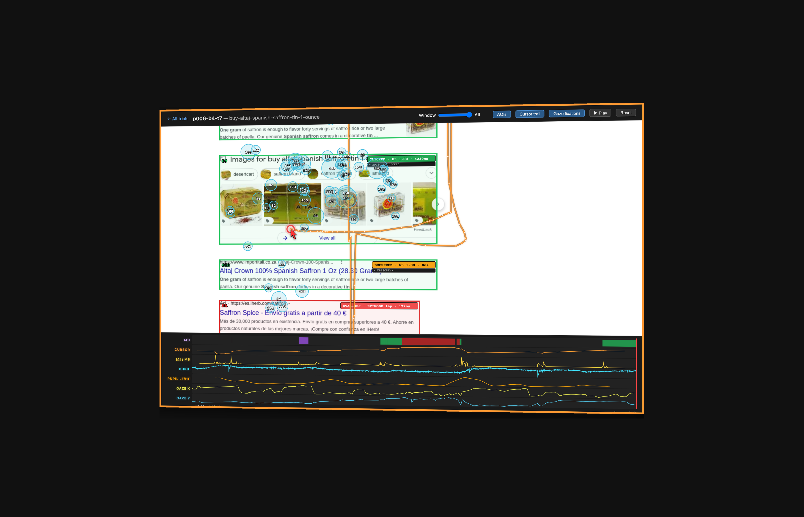
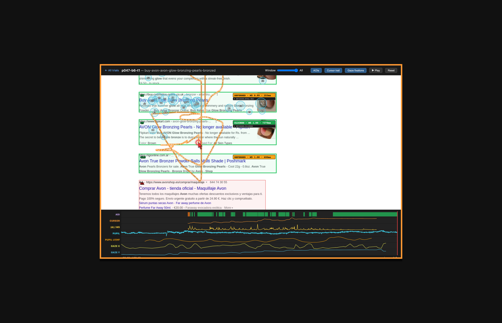
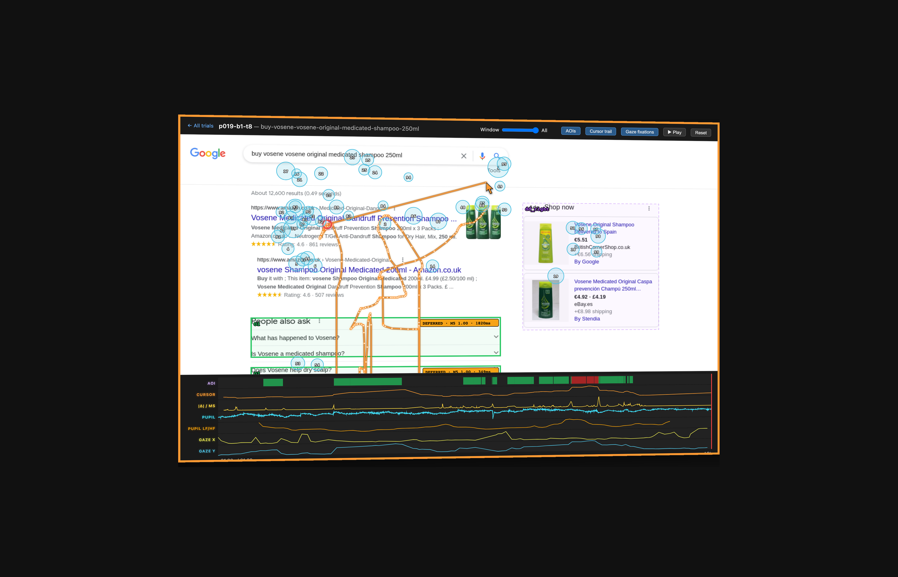

# Approach/Retreat

Two motor signal families for **ranked list layouts** (search result pages, recommendation feeds, comparison tables, product grids):

1. **Approach-retreat episodes** — per-result enter / dwell / exit behavior, classified into a four-class taxonomy (clicked / deferred / evaluated-rejected / not-approached). Cursor-based; desktop-only.
2. **Viewport dynamics** *(v0.3.0, 2026-04-19)* — per-AOI session-level measurement of how each result sits in, and moves through, the viewport. Cursor-free; works wherever scroll events + DOM bounding boxes are available (mobile, feeds, grids included). Emitted across three tiers:
    - **Impression** — MRC/IAB-aligned: was the AOI viewable (≥ 50 % pixels in view for ≥ 1 continuous second)? Plus `ms_at_50pct_or_more` as the continuous analogue without the continuity constraint.
    - **Residence** — continuous viewport analytics: `vt_any_ms`, `vt_center_ms`, `avg_viewport_y_px` (plus `max_overlap_frac` as a peak-of-overlap straddler between Impression and Residence). The banded decomposition (`vp_top_ms`, `vp_mid_ms`, `vp_bot_ms`) lives in the same tier and is retained for dashboards and explainability — band-time heatmaps and top/mid/bot residency strips are human-readable in ways `avg_viewport_y_px` alone is not. K14 shows bands add no detectable classifier AUC on top of the continuous six at n = 47 (dropped for parsimony, not ruled out).
    - **Kinematics** — scroll trajectory while the AOI is visible: `min_abs_velocity_px_per_s`, `n_reversals`. Traces external-working-memory management actions.

On AdSERP-LAB against the gaze-derived deferred-vs-evaluated-rejected label `[LAB, AdSERP, organic, NB30/NB28]`: retreat + bands combined under bbox-organic AOIs is **0.811 [0.788, 0.833]** (NB28:K38 retrain, 1,000-seed × 47-fold StratifiedGroupKFold bootstrap; source: [`attentional-foraging/docs/methodology/attribution-cascade-synthesis.md`](https://github.com/andyed/attentional-foraging/blob/main/docs/methodology/attribution-cascade-synthesis.md)). M4-alone and bands-alone bbox-equivalent bootstraps are *[bbox-organic pending; rerun under same protocol]*; the retreat + bands combined value is the gating headline. Pre-cascade legacy values *(retired 2026-05-01, kept for reference)*: M4 alone 0.796 [0.759, 0.830]; bands-alone 0.800 [0.774, 0.828]; retreat + bands combined 0.842 [0.818, 0.864] (source: [`docs/validation/viewport-bands-calibration.md`](docs/validation/viewport-bands-calibration.md)). The NB30 six-feature B∪C′ minimal set construct (continuous viewport residence + `min_abs_velocity` + `n_reversals`) holds under bbox-organic with sharper feature p-values (`min_abs_velocity` *p* = 0.008, `n_reversals` *p* = 0.017; STUB-C-3, 2026-05-02). Mobile / feed / grid transfer is capability-claimed but untested; cross-surface validation is future work.

Sister library to [ClickSense](https://github.com/andyed/clicksense).

*Current iteration of a cursor-instrumentation line that began with the Optimoz Firefox gesture extension (2001) and Uzilla (2003) — see [Precedents](#precedents-2001-2003) below and [`docs/history.md`](docs/history.md) for the full lineage.*

## See the library at work

Three AdSERP trials replayed against the **original screenshots** with four-class taxonomy labels (clicked / deferred / evaluated-rejected / not-approached) inferred from cursor episodes alone:

<table>
<tr>
<td align="center" valign="middle"><a href="https://andyed.github.io/approach-retreat/replay/trials/p006-b4-t7.html"></a><br/><sub><b>Canonical rejected</b><br/>DEF 9 · REJ 4</sub></td>
<td align="center" valign="middle"><a href="https://andyed.github.io/approach-retreat/replay/trials/p047-b6-t1.html"></a><br/><sub><b>Multi-AOI drama</b><br/>CLK 1 · DEF 9 · REJ 1 · NA 4</sub></td>
<td align="center" valign="middle"><a href="https://andyed.github.io/approach-retreat/replay/trials/p019-b1-t8.html"></a><br/><sub><b>Canonical deferred</b><br/>DEF 11 · REJ 1</sub></td>
</tr>
</table>

The backgrounds are **raw AdSERP screenshots** — what the participant actually saw, pixel for pixel. Boxes are AOIs; labels are this library's output, computed from the cursor stream alone (no eye tracker input at inference time). Full replay index: [**andyed.github.io/approach-retreat/replay/**](https://andyed.github.io/approach-retreat/replay/) — 86 curated trials across four canonical taxonomy groups.

> **Companion viewer.** For the same trials rendered through a foveated-perception simulator (showing what the participant could *resolve* at each fixation), see [attentional-foraging's cursor plots](https://andyed.github.io/attentional-foraging/). Different view of the same data — screenshot-accurate here, perception-accurate there.

## The idea

Before you click a search result, your cursor tells a story. It approaches a result (interest), dwells over it (evaluation), then either commits (click) or retreats. After the retreat, two distinct cursor signatures distinguish results the user is done with from results they may come back to: **deferred** users park the cursor while their eyes wander to alternatives (high post-closest-approach drift, long gaze and proximity dwells), then eventually scroll back; **evaluated-rejected** users move the cursor on with their eyes (low post-closest drift, short dwells) and never return. The motor-signature dissociation survives the 2026-05-01 bbox-organic attribution cascade — `deferred_vs_rejected_four_panel.png` (n=4,275 episodes, bbox-organic) shows cursor-gaze distance and total dwell each separating deferred from evaluated-rejected at *p* < 10⁻⁹ and *p* < 10⁻¹⁹ respectively. Per-(NB22:K5–K7) p-values *[bbox cell re-execution pending; legacy absolute-attribution values 1.76 × 10⁻³⁸ / 9.76 × 10⁻⁷⁰ retired]* — see [`docs/theory.md`](docs/theory.md) for the framework and the corrected geometric interpretation, and [`attentional-foraging/docs/methodology/attribution-cascade-synthesis.md`](https://github.com/andyed/attentional-foraging/blob/main/docs/methodology/attribution-cascade-synthesis.md) for the full cascade audit. The **`[WILD, ACD]`** counterpart — that the same feature family still predicts `ad_clicked` at AUC 0.821 with no eye tracker at all — is in [`analysis/attcur-validation/`](analysis/attcur-validation/README.md). The `[LAB]`/`[WILD]` split is the paper's organizational axis; see [`CLAUDE.md`](CLAUDE.md) for the convention.

### How this differs from ClickSense

**ClickSense** instruments approach + click dynamics on arbitrary clickable elements (buttons, cards, links) — vendor-agnostic motor confidence across any layout. The signal is per-click: approach velocity, hold duration, trajectory shape.

**Approach/Retreat** is SERP-specific. It models the evaluation phase across a *list* of ranked candidates, tracking enter/dwell/exit episodes at each position and classifying them into a four-class taxonomy (clicked / deferred / evaluated-rejected / not-approached). The signal is per-SERP: which results were considered, which were skipped, and which were kept in reserve.

Both libraries compose — a page can run both. ClickSense sees each click as a moment; approach-retreat sees the whole page of decisions leading up to it.

### Signals

Cursor / approach-retreat channel:

| Signal | What it means |
|--------|---------------|
| **Approach velocity** | Fast = scanning. Slow = evaluating. |
| **Dwell time** | Time cursor spends over a result's bounding box |
| **Retreat** | Cursor leaves without clicking — rejection or deferral |
| **Retreat distance** | How far the cursor moves away — far retreats predict commitment to rejection (no return), close retreats predict re-approach |
| **Arc ratio** | Path length / direct distance — curved retreats (arc ratio > 1.5) predict re-approach |
| **Re-approach** | Cursor returns to a previously visited result — reconsideration |
| **Commitment depth** | How far down the SERP before first click |

Viewport dynamics channel (cursor-free; scroll + DOM bboxes only):

| Tier | Signal | What it means |
|------|--------|---------------|
| **Impression** (MRC/IAB) | `iab_viewable` | True iff the AOI held ≥ 50 % pixel overlap with the viewport for ≥ 1 continuous second (display rule; configurable via `iabViewableThresholdMs`). |
| **Impression** | `ms_at_50pct_or_more` | Cumulative ms during which ≥ 50 % of the AOI was in view — continuous-valued analogue of the IAB threshold without the time-continuity constraint. |
| **Residence** | `vt_any_ms` | Cumulative ms the AOI had any pixel-overlap with the viewport. Lax "did the user ever see it?" — strictly more inclusive than the IAB rule. |
| **Residence** | `vt_center_ms` | Cumulative ms the AOI center was within ±100 px of the viewport center (foveal-access zone). |
| **Residence** | `avg_viewport_y_px` | Mean AOI-center viewport-y during visibility. Positional signal: near top vs near bottom. |
| **Impression / peak** | `max_overlap_frac` | Peak fraction of the AOI visible — 1.0 = fully in view at some point. Sits between impression and residence: it's the *extreme* of overlap fraction without the time-continuity constraint of `iab_viewable`. |
| **Residence (bands)** | `vp_any_ms` / `vp_top_ms` / `vp_mid_ms` / `vp_bot_ms` | Banded decomposition of residence time across top/middle/bottom thirds. Dropped from the classifier feature set for parsimony (NB30:K14) but retained for dashboards and explainability — band-time heatmaps and top/mid/bot residency strips are human-readable in ways `avg_viewport_y_px` is not. |
| **Kinematics** | `min_abs_velocity_px_per_s` | Slowest scroll velocity observed while the AOI was visible. Viewport stabilization marker. |
| **Kinematics** | `n_reversals` | Count of scroll direction reversals while the AOI was visible. External-working-memory reload signal. |

## Install

```bash
npm install andyed/approach-retreat
```

Or via script tag:

```html
<script src="dist/approach-retreat.js"></script>
```

## Quick start

```js
import { ApproachRetreat } from 'approach-retreat';

const ar = new ApproachRetreat({
  resultSelector: '[data-result]',
  onEpisode: (episode) => console.log(episode),
  onClick: ({ position, episode }) => {
    console.log(`Clicked position ${position} after ${episode.dwell_ms}ms`);
  },
});
```

Mark your SERP results:

```html
<div data-result data-position="0">
  <h3>Result title</h3>
  <p>Snippet text...</p>
</div>
<div data-result data-position="1">
  <h3>Another result</h3>
  <p>More snippet text...</p>
</div>
```

### Recommended: tag the surface type with `data-etype`

If your SERP mixes ads and organics in the result column (most commercial SERPs), tag each with `data-etype` so your dashboard can slice ad-vs-organic behavior:

```html
<div data-result data-position="0" data-etype="dd_top">
  <h3>Sponsored carousel cell</h3>
  ...
</div>
<div data-result data-position="1" data-etype="organic">
  <h3>Organic result title</h3>
  ...
</div>
<div data-result data-position="2" data-etype="native_ad">
  <h3>Inline-text ad</h3>
  ...
</div>
```

Conventional values that match the AdSERP analysis vocabulary:
- `organic` — first-class organic search result.
- `dd_top` — top-of-page ad carousel cell (Google's "dd_top" element class).
- `native_ad` — text-link ad embedded in the result column.

Any data-* attribute is automatically passed through to PostHog under `target_data_<key>` (per the bundled adapter), so dashboard-level filtering by surface type is one filter expression away. The library itself is etype-agnostic at the machinery level — episode capture, M5 inference, four-class taxonomy, and the nine-feature M4 vector all work identically with or without etype tags. **What you give up by going undifferentiated is the ability to slice in your dashboard, not the ability to capture.**

**Why this matters.** The 2026-05-01 cascade analysis on AdSERP found that **dd_top click rate is 17.1 % vs organic 14.6 % vs native_ad 5.2 %** (n=14,657 organic / 1,581 dd_top / 3,670 native_ad records; two-proportion test dd_top − organic Δ = +2.58 pp, *p* = 6 × 10⁻³, 95 % CI [+0.64, +4.52] pp [unpooled Wald, computed from `attentional-foraging/scripts/output/aoi-consumer-cascade/four_class_taxonomy_hybrid.json`]; AF NB21:K-bbox-* etype breakdown). The dd_top advantage was structurally invisible under the older "rank N" pooling because dd_top fixations got absorbed into "organic position 1." Production deployers that don't tag etype get the rank-pooled view, which is fine for aggregate analytics but loses the ad-vs-organic story.

**Calibration footnote.** M5 was trained against bbox-organic NB22 labels (organic-only positions). Applying it to ad fixations produces probabilities calibrated against organic-deferred-vs-rejected behavior. The features themselves (mean_dist, dwell_in_proximity, direction_changes…) are pure cursor patterns and transfer cleanly; the decision boundary may be slightly off on ads but the binary classification mostly survives. An ad-only M5 retrain is a follow-up if production deployers need ad-side calibration.

## Episode data

Every completed cursor visit to a result produces a 23-field episode from `Episode.toJSON()` (19 cursor fields + 4 banded-viewport fields, the latter null when `trackViewportBands: false`). Grouped by purpose:

```js
{
  // --- Identity + outcome ---
  position: 2,                    // rank in the SERP (from data-position)
  outcome: 'deferred',            // four-class: clicked | deferred | evaluated_rejected | not_approached
  visited: true,                  // always true for emitted episodes
  clicked: false,
  retreated: true,
  visit_number: 2,                // 1 = first visit, 2+ = re-approach

  // --- Timing (all ms, performance.now() base) ---
  dwell_ms: 847,                  // total time cursor was over the AOI
  entered_at: 1412.38,            // when cursor crossed into the AOI
  exited_at: 2259.77,             // when cursor left the AOI
  clicked_at: null,               // populated only when the visit ended in a click

  // --- Cursor dynamics ---
  approach_velocity: 0.34,        // px/ms at the moment of entry
  approach_angle: 1.21,           // radians, atan2(vy, vx) at entry
  peak_velocity: 0.89,             // max speed while over the result
  min_velocity: 0.02,              // min speed while over — near-pause = reading
  retreat_distance: 186,           // px from AOI center at max retreat (0 if clicked)
  sample_count: 51,                // number of raw mousemove samples captured

  // --- Scroll context (forward/regressive split) ---
  direction: 'forward',            // 'forward' = at/near scroll HWM, 'regressive' = scrolled back up
  entry_scroll: 420,               // window.scrollY at entry
  hwm_at_entry: 420,               // running max of scrollY at entry
}
```

### Raw trajectory (opt-in)

Set `includeSamplesInEpisodeJson: true` on the library to add a `samples` array to each episode. Every sample is `{ x, y, t, vx, vy }` at the native mousemove rate (typically 60Hz). This is research-grade material — keep it local unless you're shipping it to an instrumented adapter like PostHog (see below).

```js
const ar = new ApproachRetreat({
  resultSelector: '[data-result]',
  includeSamplesInEpisodeJson: true,
  onEpisode: (ep) => saveForAnalysis(ep),
});
```

### PostHog capture shape

The bundled PostHog adapter (`adapters/posthog.js`) ships three event types, all prefixed `ar_`:

| Event | Fires on | Key fields |
|---|---|---|
| `ar_episode` | every finalized episode | all 19 fields above + optional `ar_trajectory` (flat `[x,y,t_rel_ms,vx,vy,...]` array, 10% sample rate by default) |
| `ar_click` | every click on a result | pre-click velocity, angle, direction, retreat distance, dwell before click |
| `ar_session_summary` | `visibilitychange` / `pagehide` | four-class taxonomy counts, positions per class, forward/regressive counts, time-to-first-click, max position approached |

Every event is merged with a session context: `ar_session_id`, `ar_layout`, `ar_query_id`, viewport (`w`, `h`, `dpr`), UA, referrer, page path, load time.

Dev kill-switch: append `?ph=0` to any URL to skip PostHog entirely.

### Library-side classification

```js
ar.classify();
// { clicked: [{position, ...}], deferred: [...],
//   evaluated_rejected: [...], not_approached: [...] }

ar.getSignals();
// [{ position, outcome, total_dwell_ms, mean_retreat_distance,
//    visit_count, retreat_count, reapproach_count, ... }, ...]

ar.getEpisodes();  // full list, one entry per finalized visit
ar.flush();        // finalize in-flight episodes without clearing history
```

### Canonical nine-feature M4 vector

The library ships the same nine-feature extractor used in the Edmonds 2026
CIKM paper (*Cognitive Task Models Recover SERP Examination Signal Invisible
to Atheoretic Cursor Feature Extraction*). One vector per result position
per session, aggregated over the whole-trial cursor stream against each
result's page-space Y center. These are the features M4 (click prediction,
`[LAB, NB21:K-bbox-4]` LOSO AUC **0.864** under bbox-organic / **0.870** under
hybrid attribution, and `[WILD, ACD]` LOSO AUC 0.821) and M5
(deferred-class detection, calibration methodology) consume.

```js
ar.getApproachFeatures();
// [
//   { position: 0,
//     min_dist: 2.0,               // min |Δy| to result center (px)
//     mean_dist: 143.15,           // mean |Δy|
//     final_dist: 200.0,           // last |Δy|
//     retreat_dist: 198.0,         // final_dist − min_dist (post-closest drift)
//     dwell_in_proximity_ms: 466,  // time within 100 px of center
//     mean_approach_velocity: 238, // mean −Δdist/Δt (px/s, toward result)
//     max_approach_velocity: 966,  // peak approach speed
//     direction_changes: 11,       // sign flips in approach velocity
//     frac_decreasing: 0.62,       // fraction of samples with decreasing dist
//     sample_count: 64 },
//   { position: 1, ... },
//   ...
// ]
```

**Parity.** The JavaScript `ResultFeatureTracker` is bit-compatible with the
Python reference implementation in
[`attentional-foraging/scripts/compute_cursor_approach_features.py`](https://github.com/andyed/attentional-foraging/blob/main/scripts/compute_cursor_approach_features.py)
(supports `--attribution {absolute, organic, organic_hybrid}` post-2026-05-01
cascade); all nine features match within 1e-6 on identical input. The parity test
lives at `scripts/test_feature_tracker_parity.{js,py}`.

**Calibration for the deferred-class detector (M5).** See
[`docs/validation/m5-calibration.md`](docs/validation/m5-calibration.md) for
the end-to-end calibration methodology.

### Viewport dynamics vector (cursor-free)

The second feature family the library emits is viewport dynamics — one
record per AOI at session granularity, computed from scroll events plus
DOM bounding boxes alone. No cursor dependency, so this channel runs
anywhere the page logs `scroll` events (including mobile and feed
surfaces where cursor telemetry is unavailable).

```js
ar.getViewportAnalytics();
// [
//   { position: 0,
//     // Impression (MRC/IAB)
//     iab_viewable: true,              // ≥ 50 % pixels visible for ≥ 1 s continuous
//     ms_at_50pct_or_more: 2400,       // cumulative ms at ≥ 50 % overlap
//     // Residence (continuous)
//     vt_any_ms: 6200,                 // cumulative ms with any viewport overlap
//     vt_center_ms: 1800,              // cumulative ms with AOI center near viewport center
//     avg_viewport_y_px: 340,          // mean AOI-center viewport-y during visibility
//     max_overlap_frac: 1.0,           // peak fraction of AOI visible
//     // Kinematics (scroll trajectory while visible)
//     min_abs_velocity_px_per_s: 0,    // slowest |scroll velocity| during visibility
//     n_reversals: 2 },                // scroll direction reversals during visibility
//   { position: 1, ... },
//   ...
// ]

ar.getViewportAnalyticsContext();
// { viewport_h: 900,
//   viewport_center_tol_px: 100,
//   iab_viewable_threshold_ms: 1000,
//   schema: 'edmonds-2026-vpanalytics-v1' }

ar.getViewportBands();
// [{ position, vp_any_ms, vp_top_ms, vp_mid_ms, vp_bot_ms }, ...]
// Banded decomposition of residence time — retained for dashboards.
```

**Feature-family selection.** The six-feature minimal set (residence + kinematics, `vt_any_ms` / `vt_center_ms` / `avg_viewport_y_px` / `max_overlap_frac` / `min_abs_velocity_px_per_s` / `n_reversals`) was picked by forward selection (NB30:K18; under bbox-organic re-derivation: `min_abs_velocity` at *p* = 0.008, `n_reversals` at *p* = 0.017; step 3 `pause_ms` fails at *p* = 0.117 [STUB-C-3, 2026-05-02]; legacy absolute-attribution values were *p* = 0.039 and 0.038, retired) and recovers the full NB30 11-feature deferred-vs-rejected lift within +0.003 per-p AUC (full − minimal Δ = +0.003, *p* = 0.57; minimal-vs-baseline lift +0.017, *p* = 4 × 10⁻⁴); the other five trajectory features add no detectable AUC once these two are present. `pause_ms` is not emitted — collinear with `vt_any_ms` at *r* = 0.996 under bbox-organic (NB30:K17).

**Config:** `trackViewportAnalytics` (default `true`), `viewportCenterTolPx` (default 100, NB30:K22 sweep flat across 16× range), `iabViewableThresholdMs` (default 1000 for the MRC display rule; set 2000 for video).

**Parity.** `computeViewportAnalyticsPure` is bit-compatible with the Python reference in `attentional-foraging/scripts/nb30_scroll_trajectory.py`; all 8 analytics fields match within 1e-6 on identical input. The parity test lives at `scripts/test_viewport_analytics_parity.{js,py}`.

## Relevance scoring

```js
const scores = ar.computeRelevance();
// [{ position: 0, score: 0.72, signals: {...} }, ...]
```

Weights: dwell time (40%), re-approaches (30%), clicks (30%), with a small penalty for repeated retreats.

## Using with ClickSense

Both libraries work on the same page. ApproachRetreat captures the evaluation phase; ClickSense captures the commitment moment.

```js
import { ClickSense } from 'clicksense';
import { ApproachRetreat } from 'approach-retreat';

const cs = new ClickSense({ enableApproachDynamics: true, onCapture: ... });
const ar = new ApproachRetreat({ resultSelector: '[data-result]', onEpisode: ... });
```

## Live experiment

The [gh-pages site](https://andyed.github.io/approach-retreat/) runs the library across **five layout variants** (narrow vertical, wide two-pane, card grid, dense titles-only, rich thumbnail) crossed with **four Q&A SERPs**, producing 20 bookmarkable combinations. Every variant uses the same library contract and emits the same episode schema — the layout is the variable, the instrumentation is the constant.

Each Q&A SERP presents a question with synthetic answers representing a discourse arc over time, plus an injected ad to test discrimination cost (the approach-retreat signature when users identify sponsored content):

| Question | Year range | Flavor |
|---|---|---|
| Will AI be an existential threat to humanity? | 2011–2025 | Technical / philosophical, consensus shift |
| Is The A-Team the dumbest great show ever made? | 1984–2024 | Nostalgic / critical, multi-decade reappraisal |
| Are cats intelligent? | 2011–2025 | Scientific / anecdotal, research drift |
| What was your favorite sunset? | 2013–2024 | Personal / experiential, no consensus to shift |

**Telemetry is live.** Every cursor episode, click, and session summary ships to PostHog via the bundled adapter (same project as the attentional-foraging scanpath viewer). Episodes include the optional 10%-downsampled trajectory as research-grade material. Press `d` on any SERP page to toggle the in-page debug overlay showing episodes, retreats, and the four-class classification. Append `?ph=0` to any URL to disable capture.

## Adapters

- `approach-retreat/adapters/posthog` — PostHog event flattening
- `approach-retreat/adapters/callback` — Buffer + flush (sendBeacon, etc.)

## Background reading

- **[`docs/theory.md`](docs/theory.md)** — Concise theoretical writeup. What the library measures, what the signals mean, the lineage of cursor-on-SERP work, and what we initially proposed but rejected after the data didn't support it.
- **[`docs/one-pager.md`](docs/one-pager.md)** — Why a task model beats a 638-feature bag for SERP cursor analysis. The four-class taxonomy, discrimination cost, retreat geometry as deliberation indicator. Citations to prior work.
- **[`docs/validation/attcur-bruckner.md`](docs/validation/attcur-bruckner.md)** — Public head-to-head validation against Brückner, Arapakis & Leiva (SIGIR '21) on their own benchmark. Approach-retreat features beat a scalar mouse-length baseline by +12.5 AUC on ad click prediction (0.821 vs 0.696) with a non-learned 11-feature logistic regression. Reproduction pipeline at [`analysis/attcur-validation/`](analysis/attcur-validation/).
- **[`docs/history.md`](docs/history.md)** — How we got here. A personal history of cursor instrumentation from 2001 (Lucidity + the Optimoz gesture extension's real-time cursor-vector compression, Slashdotted and installed by millions) through Uzilla 2003 ("mouse miles" path length + the DOM-path signature) to ClickSense and approach-retreat. Complements the Leiva/Arapakis lineage table below with the other side of the story.

## Related work

This library is the instrumentation half of a two-part research program:

- **Analysis:** [attentional-foraging](https://github.com/andyed/attentional-foraging) — a reanalysis of the AdSERP dataset (Latifzadeh, Gwizdka & Leiva, SIGIR '25; 2,776 trials, 47 participants, simultaneous eye + mouse + scroll + pupil tracking) that produces the OSEC task model and the four-class taxonomy.
- **Instrumentation:** this library — the task model in runnable form. You get the signal without the eye tracker.

### Precedents (2001–2003)

The modern IR cursor literature did not start in 2012 with Huang et al. Two of its foundational primitives were already codified in the early 2000s, in browser instrumentation work that predates the SIGIR cursor-on-SERP thread by roughly a decade. Approach-retreat is directly descended from both.

| Year | Release | Primitive | Modern re-derivation |
|---|---|---|---|
| **2001** | [Optimoz](http://optimoz.mozdev.org/) — Firefox gesture extension, [Slashdotted](https://www.flickr.com/photos/andyed/125275288/), installed by millions | **Real-time cursor-vector compression** via the gesture-recognition algorithm. Turned cursor-trajectory summarization from a batch lab exercise into something running live in every gesture-enabled Firefox. | **Villaizán-Vallelado et al.** (SIGIR '25) — Seq2Seq Transformer over raw cursor-trajectory embeddings, 24 years later. Same primitive, different decoder. |
| **2003** | **Edmonds.** [*Uzilla: A new tool for Web usability testing*](https://link.springer.com/article/10.3758/BF03202549) (Behavior Research Methods, Instruments, & Computers 35(2):194–201) | **"Mouse miles"** — integrated cursor path length (and its horizontal/vertical decomposition) as a summative usability measure, reported alongside time-on-task and success rate. Used in a 2002 Clemson case study comparing left- vs right-hand navigation on a SERP-like test site. | **Brückner, Arapakis & Leiva** (SIGIR '21) — "When Choice Happens: A Systematic Examination of Mouse Movement Length for Decision Making in Web Search." Same primitive, same framing, 18 years later. |

Uzilla also introduced the **DOM-path click signature** — identifying click targets by their full DOM-tree path rather than pixel position. That one is arguably the most widely adopted idea from the paper, silently embedded in most modern web analytics, session-recording, A/B testing, and accessibility tools.

See [`docs/history.md`](docs/history.md) for the full lineage (Lucidity 2001 → Optimoz 2001 → Uzilla 2003 → ClickSense 2026 → approach-retreat 2026) and the Slashdot front-page screenshot. Approach-retreat adds a **task model** on top of these primitives — the four-class taxonomy (clicked / deferred / evaluated_rejected / not_approached) reframes the same cursor primitives as labels rather than features.

### The Leiva/Arapakis research program

The cursor-on-SERP lineage this work builds on runs through a single sustained collaboration — Luis Leiva and Ioannis Arapakis have been producing the foundational datasets, features, and baselines for more than a decade. Approach/retreat is best understood as a task-model layer on top of their instrument.

| Year | Paper | What it contributed |
|---|---|---|
| 2016 | Arapakis & Leiva. ["Predicting user engagement with direct displays"](https://dl.acm.org/doi/10.1145/2911451.2911505) (SIGIR) | 638 cursor features → 0.86 AUC attention prediction on Yahoo Knowledge Modules. Established that cursor telemetry alone is strong signal. |
| 2020 | Arapakis, Penta, Joho & Leiva. "A Price-per-attention Auction Scheme Using Mouse Cursor Information" (ACM TOIS) | Cursor-derived attention as an auction-scheme currency — the economic framing that motivates the rest of the program. |
| 2020 | Arapakis & Leiva. "Learning Efficient Representations of Mouse Movements to Predict User Attention" (SIGIR) | Neural-embedding precursor to AdSight — learned representations of cursor trajectories. |
| 2020 | Leiva & Arapakis. ["The Attentive Cursor Dataset"](https://doi.org/10.3389/fnhum.2020.565664) (Frontiers) | 2,737 users, cursor + self-reported attention labels + SERP HTML. Largest public cursor-on-SERP dataset. |
| 2021 | Leiva, Arapakis & Iordanou. "My Mouse, My Rules" (CHIIR) | Privacy analysis of the same telemetry primitives — important context for any deployment. |
| 2021 | **Brückner, Arapakis & Leiva.** ["When Choice Happens: A Systematic Examination of Mouse Movement Length for Decision Making in Web Search"](https://dl.acm.org/doi/10.1145/3404835.3463011) (SIGIR) | Scalar "mouse movement length" as a relevance signal. **This is the closest published work to approach/retreat — a single-feature version of what the four-class taxonomy decomposes.** |
| 2025 | Latifzadeh, Gwizdka & Leiva. "A Versatile Dataset of Mouse and Eye Movements on Search Engine Results Pages" (SIGIR) | AdSERP: eye + mouse + pupil + ad boundaries on 2,776 trials. The dataset this work is built on. |
| 2025 | Arapakis et al. "AdSight" (SIGIR) | Transformer-based click prediction from cursor + layout. The modern black-box counterpart to the task-model approach here. |

### What approach/retreat adds

Each of the papers above treats cursor behavior as a *signal to decode*. None of them adopt a **task model** for the evaluation phase. The contribution here is specifically the OSEC → four-class decomposition, which turns a 638-feature brute-force problem into a ~6-feature parsimonious one and recovers an interpretable taxonomy (clicked / deferred / evaluated-rejected / not-approached) instead of a scalar score.

### Validation against AdSERP (attentional-foraging)

The four-class taxonomy and retreat geometry claims are validated in the attentional-foraging notebooks:

- **Click prediction (NB21, NB22):** Episode-level features (dwell, retreat distance, arc ratio, visit count) → **AUC 0.865** for click prediction under bbox-organic attribution (LOSO M3, NB21:K-bbox-3, post-2026-05-01 cascade), **0.870** under hybrid attribution (bbox organics + dd_top + native_ad in display order). Per-etype on hybrid: organic **0.868**, dd_top (top ads) **0.916**, native_ad **0.831**. The dd_top vs organic click-rate gap that drives this etype-aware advantage is documented above with stats; under absolute attribution it was structurally invisible because dd_top fixations got pooled into "organic position 1." Competitive with Arapakis & Leiva 2016 (0.86 AUC, 638 features) using the 9-feature M4 vector because the task model tells you which features matter.
- **Retreat arc geometry (NB24, rebuilt 2026-05-01 under organic_hybrid):** Bbox-hybrid pool yields **5,201 raw arcs** (vs 1,490 under absolute, +3.5× coverage); top-ad lateral/arc 0.166 → **0.170 replicates** under the new attribution. Per-element-type arc-ratio significance under participant clustering *[bbox re-derivation pending]*; the 1.50/1.31 absolute-attribution ratios are retired. The canonical motor-signature anchor for the four-class dissociation is `[NB22:K5–K7]` (post-closest drift + gaze dwell + proximity dwell). Bbox-era render `deferred_vs_rejected_four_panel.png` carries the dissociation cleanly at *p* < 10⁻⁹ on cursor-gaze distance and *p* < 10⁻¹⁹ on dwell.
- **Discrimination cost (NB20):** Top ads evaluate *more* expensively than organic (the C/W/L violation; absolute-attribution numbers — 2× approach rate, 2.3× dwell, 1.7× direction changes during retreat, +0.41% pupil dilation — *[bbox re-derivation pending]*). The hybrid-attribution dd_top finding (per-etype M3 AUC 0.916, click-rate gap above) is consistent with the discrimination-cost framing: ads cost more to evaluate but pay back more often when the user resolves them.
- **Public head-to-head against Brückner et al. 2021:** See [`docs/validation/attcur-bruckner.md`](docs/validation/attcur-bruckner.md). Approach-retreat features beat the Brückner scalar mouse-movement-length baseline by +12.5 AUC (0.821 vs 0.696) on their own ad-click-prediction benchmark, using an 11-feature logistic regression — no neural network, no embeddings. The task model is the whole reason for the gap.

### Framework extensions

- **C/W/L (Azzopardi, Thomas & Craswell, SIGIR '18)** predicts user evaluation cost decreases with position — ads should be cheaper than organic because they demand less reading. The AdSERP data shows the opposite for top ads: discrimination ("is this ad or result?") is a cost C/W/L doesn't model. Element-type interaction lift on top-ad click prediction *[NB22:K9 bbox re-derivation pending; legacy 0.909 → 0.919 retired]*; the hybrid-attribution surface-aware M3 AUC on the dd_top subset is **0.916**, directionally consistent with the click-rate gap above. A CIKM 2026 paper draft formalizes this as a missing variable in the framework.
- **Information Foraging Theory (Pirolli & Card, 1999)** provides the patch-leaving vocabulary, but operates at the session level. OSEC applies the same foraging lens at the per-result evaluation level — each result is a mini-patch with its own cost and reward. Retreat geometry is the motor trace of the patch-leaving decision.

### Datasets used for validation

- [AdSERP](https://github.com/kayhan-latifzadeh/AdSERP) — primary, via attentional-foraging
- [The Attentive Cursor Dataset](https://gitlab.com/iarapakis/the-attentive-cursor-dataset) — public (no permission required), 2,737 users, self-reported attention labels, for scale replication. Cloning and taxonomy validation pending.
- [Brückner et al. 2021 artifacts](https://dl.acm.org/doi/10.1145/3404835.3463011) — head-to-head beat documented in [`docs/validation/attcur-bruckner.md`](docs/validation/attcur-bruckner.md).

## References

- Edmonds (2003). ["Uzilla: A new tool for Web usability testing"](https://link.springer.com/article/10.3758/BF03202549) — instrumented Mozilla browser, "mouse miles" (integrated cursor path length), DOM-path click signature, cursor-vector compression via Optimoz's gesture recognition algorithm. Behavior Research Methods, Instruments, & Computers 35(2):194–201.
- Huang, White & Buscher (2012). ["User see, user point"](https://jeffhuang.com/papers/GazeCursor_CHI12.pdf) — gaze-cursor alignment on SERPs, 700 ms lag, behavior-dependent (CHI '12)
- Guo & Agichtein (2012). ["Beyond dwell time"](https://dl.acm.org/doi/10.1145/2187836.2187914) — post-click cursor movements for document relevance (WWW '12)
- Arapakis & Leiva (2016). ["Predicting user engagement with direct displays"](https://dl.acm.org/doi/10.1145/2911451.2911505) — 638 cursor features, AUC 0.86 for attention prediction (SIGIR '16)
- Leiva & Arapakis (2020). ["The Attentive Cursor Dataset"](https://doi.org/10.3389/fnhum.2020.565664) — 2,737 users, cursor + attention labels + SERP HTML (Frontiers)
- Edmonds (2016). ["Learning from Complex Online Behavior"](https://youtu.be/j38fm48gTgg?t=1348) — click hold duration as cognitive signal

## License

MIT
