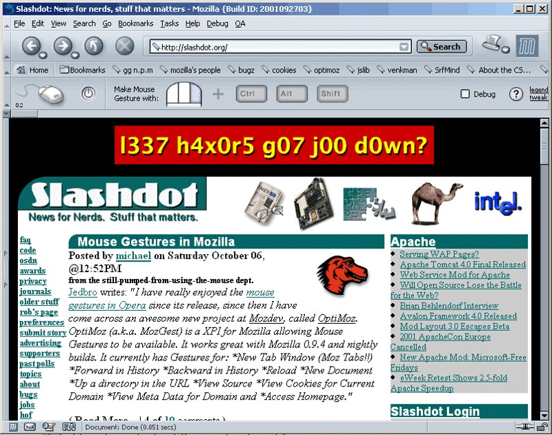

# How We Got Here: A Personal History of Cursor Instrumentation

**Andy Edmonds, 2026**

This library is the current iteration of a line of work I have been running in one form or another since 2001. The short version is: every time the web has reorganized itself (static pages → dynamic DOMs → recommendation feeds → AI-assisted interfaces), the cursor has needed new instrumentation, and each time the instrumentation itself has turned out to be the more durable contribution than whatever I thought I was measuring with it.

---

## 2001 — Lucidity and real-time gesture recognition

The earliest release was **Lucidity**, a small JavaScript library I put on SourceForge (`sourceforge.net/projects/lucidity/`) for scroll-corrected cursor-entry and click-timing instrumentation on web pages. It did one thing cleanly: compute where the mouse was when the user first interacted, how long it took to get there, and how far they had scrolled to reach it. Scroll correction (adding `document.body.scrollTop` to `event.clientY` before logging) was a small thing to get right and most contemporary instrumentation tools did not.

The more important thing that happened in 2001 was parallel. I was working on some gesture recognition code that was useful in principle but only ran in batch mode — you had to stop capturing, hand the buffer to the recognizer, then start capturing again. An open-source contributor from the Mozilla community picked it up and fixed it to run in real time against a live event stream. That work grew into [**Optimoz**](http://optimoz.mozdev.org/), the Firefox gesture extension hosted at `optimoz.mozdev.org`. Optimoz got [Slashdotted](https://www.flickr.com/photos/andyed/125275288/) — the front-page feature was the catapult that pulled in community contribution to the gesture recognition algorithm, and it went on to be installed by millions of Firefox users over the years that followed. The real-time fix was the enabling step: it took cursor-vector compression out of lab-report territory and into the browser of anyone who wanted it. That moment is the chronological and technical ancestor of every cursor-trajectory-embedding paper written in the two decades since.

  
   
  <em>Slashdot front page, October 2001 — "Mouse Gestures in Mozilla." The feature catapulted community contributions into Optimoz's gesture-recognition algorithm, which in turn fed the cursor-vector compression primitive later codified in Uzilla (<a href="https://www.flickr.com/photos/andyed/125275288/">Flickr</a>).</em>

## 2003 — Uzilla and "mouse miles"

**Uzilla** was an instrumented Mozilla browser I built as my MS thesis work at Clemson under Andrew Duchowski's supervision. It was published in 2003 in *Behavior Research Methods, Instruments, & Computers* (Psychonomic Society), 35(2):194–201. Two primitives codified in that paper have been re-discovered repeatedly since:

1. **Mouse miles — integrated path length as a performance measure.** Uzilla logged the total distance the cursor traveled during a task, decomposed by horizontal and vertical direction, and reported the number alongside time-on-task and success rate as a summative usability metric. A late-2002 case study supervised by Duchowski used mouse miles to compare left-hand and right-hand navigation layouts on a real SERP-like test site at Clemson. Brückner, Arapakis & Leiva (SIGIR '21) treated mouse movement length as "a systematic examination" 18 years later. The primitive is the same, the framing is the same, the measurement is the same.

2. **Cursor vector compression via the Optimoz gesture recognition algorithm.** Uzilla compressed cursor trajectories into directional-summary vectors at logging time — cited in the paper as drawing on the real-time Optimoz work. Villaizán-Vallelado et al. (SIGIR '25) revived this approach with a Seq2Seq Transformer that takes raw cursor-trajectory embeddings as input, 22 years later. Same primitive, different decoder.

Both of these live in the peer-reviewed BRMIC 2003 paper — not just in informal demos or blog posts. The lineage is direct.

## The DOM signature

Uzilla also introduced what the 2003 paper called *"identifying path from within the document object model (DOM) of the HTML page or Mozilla browser interface"* — recording clicks not by pixel position but by the full DOM-tree path of the target element. At the time I thought of this as a practical necessity for logging clicks through dynamic pages where pixel positions kept moving between sessions.

In retrospect, **the DOM signature is probably the most widely adopted idea from Uzilla**: modern web analytics, session recording tools, A/B testing platforms, accessibility testers, and error-tracking services all use some variant of *"identify this element by its DOM path, not by where it happened to render today."* Many of the people using it have no idea that is where it came from, which is fine — that is what open-source instrumentation primitives do when they work. The DOM signature was introduced as a side effect of building Uzilla; it outlived the cursor-tracking motivation entirely.

## The ClickSense experiment

A much later thread: in 2016 I gave a talk ["Learning from Complex Online Behavior"](https://youtu.be/j38fm48gTgg?t=1348) about click-hold duration — the time between `mousedown` and `mouseup` — as a cognitive signal. The intuition was that hesitation at the click moment carries information about decision confidence. For several years the YouTube video was the only public record.

The idea eventually turned into [**ClickSense**](https://github.com/andyed/clicksense), which instruments approach geometry plus hold duration on any clickable target, page- and layout-agnostic. A subsequent collaboration showed there really is a tiny but consistent signal in up/down latency — small enough that it took a proper replication to nail down, and the results are still in the "yet to publish" drawer as of this writing.

ClickSense is the element-agnostic sibling of the library you are reading now. It answers *how was this click made?* Approach-retreat answers *what was the user doing across this list before they clicked?* The two compose on the same page.

## Why all of this ends up here

Approach-retreat is the part of the lineage that treats the ranked list as the unit of analysis and the cursor–AOI episode as the unit of inference. The cursor still gets tracked the same way it has been since Uzilla (scroll-corrected coordinates, DOM-path events, retreat geometry). The integrated path length is still one of the things we compute. The vector-compression primitive is still a useful ancillary. What is new in *this* library is the **task model** on top — the four-class taxonomy (clicked / deferred / evaluated-rejected / not-approached) that reframes the same cursor primitives as training *labels* rather than training *features*.

Twenty-five years in the same corner of this problem means I have watched a lot of the same primitives get re-derived as if they were new. This library is trying to publish the task-model layer that was always missing, on top of the instrumentation primitives that never actually went away.

---

## Timeline reference

| Year | Release | Primitive introduced |
|---|---|---|
| 2001 | Lucidity (SourceForge) | Scroll-corrected cursor entry + click-timing JS instrumentation |
| 2001– | Optimoz (`optimoz.mozdev.org`) — community Firefox gesture extension, Slashdotted, installed by millions | Real-time cursor-vector compression via gesture recognition |
| **2003** | **Uzilla (BRMIC 35(2):194–201)** | **"Mouse miles" (integrated path length), DOM-path signature, cursor-vector compression in an instrumented browser** |
| 2016 | "Learning from Complex Online Behavior" talk | Click-hold duration as a cognitive signal |
| 2026 | ClickSense | Element-agnostic approach geometry + hold duration |
| 2026 | **approach-retreat** (this library) | **List-aware cursor–AOI episodes and the four-class taxonomy** |

## Citations for the prior work in this history

- Edmonds, A. (2003). *Uzilla: A new tool for Web usability testing.* Behavior Research Methods, Instruments, & Computers, 35(2), 194–201.
- Edmonds, A. (2001). *Lucidity* [Software]. SourceForge. `sourceforge.net/projects/lucidity/`
- Optimoz (2002). *CVS tag 0.3.4.* `optimoz.mozdev.org/gestures/` — Firefox gesture extension, cited in Edmonds 2003 for its real-time cursor vector compression.
- Brückner, L., Arapakis, I. & Leiva, L. A. (2021). *When Choice Happens: A Systematic Examination of Mouse Movement Length for Decision Making in Web Search.* SIGIR '21.
- Villaizán-Vallelado, M. et al. (2025). *AdSight: Scalable and Accurate Quantification of User Attention in Multi-Slot Sponsored Search.* SIGIR '25.
- Edmonds, A. (2026). *ClickSense.* `github.com/andyed/clicksense`
